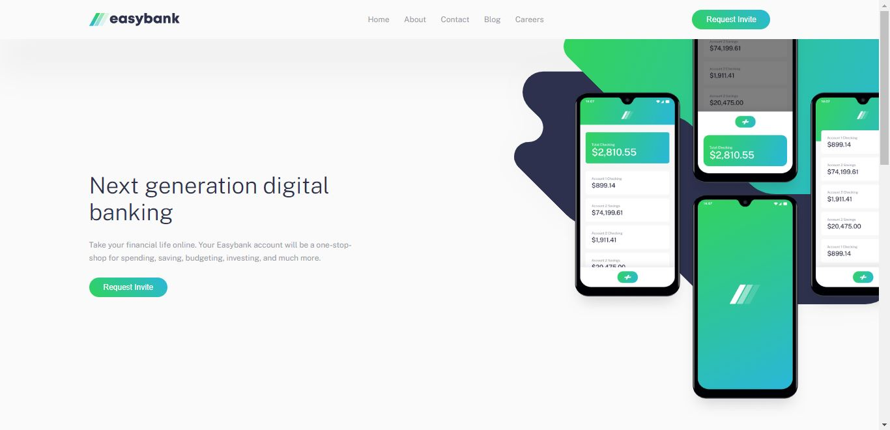
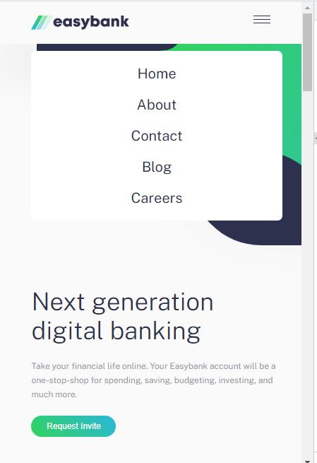

# Frontend Mentor - Easybank landing page solution

This is a solution to the [Easybank landing page challenge on Frontend Mentor](https://www.frontendmentor.io/challenges/easybank-landing-page-WaUhkoDN). Frontend Mentor challenges help you improve your coding skills by building realistic projects.

## Table of contents

- [Overview](#overview)
  - [The challenge](#the-challenge)
  - [Screenshot](#screenshot)
  - [Links](#links)
- [My process](#my-process)
  - [Built with](#built-with)
  - [What I learned](#what-i-learned)
  - [Continued development](#continued-development)
- [Author](#author)

## Overview

### The challenge

Users should be able to:

- View the optimal layout for the site depending on their device's screen size
- See hover states for all interactive elements on the page

### Screenshot




### Links

- Solution URL: [easybank-landing](https://github.com/N-Ignacio-Bouffanais/Easybank-landing-page)
- Live Site URL: []()

## My process

### Built with

- Semantic HTML5 markup
- CSS custom properties
- CSS Grid
- SASS
- PNPM

### What I learned

```html


```

```css
a {
  color: $Dark-Blue;
  margin: 1rem 0;
  font-size: 2rem;
  &:hover {
    text-decoration: underline $Lime-Green 0.3rem;
    text-underline-offset: 1.2rem;
  }
}
```

```js
const x = document.getElementById("close")
const y = document.getElementById("hamburguer")

function Open() {
    if (window.innerWidth <= 830) {
        x.style.display = "block";
        y.style.display = "none";
    }
    else {
        x.style.display = "none";
        y.style.display = "none";
    }
}
function Close() {
    if (window.innerWidth <= 830) {
        x.style.display = "none";
        y.style.display = "block";
    }
    else {
        x.style.display = "none";
        y.style.display = "none";
    }
}
```

### Continued development
I want to practise JavsScript ES6+ and Typescript.
Also I will practise with nodejs to become a FullStack developer.

## Author

- Website - [Nicolas_Bouffanais](https://nicolas-bouffanais.vercel.app/src/index.html)
- Frontend Mentor - [@N-Ignacio-Bouffanais](https://www.frontendmentor.io/profile/N-Ignacio-Bouffanais)
- Twitter - [@N_Bouffanais](https://twitter.com/N_Bouffanais)
